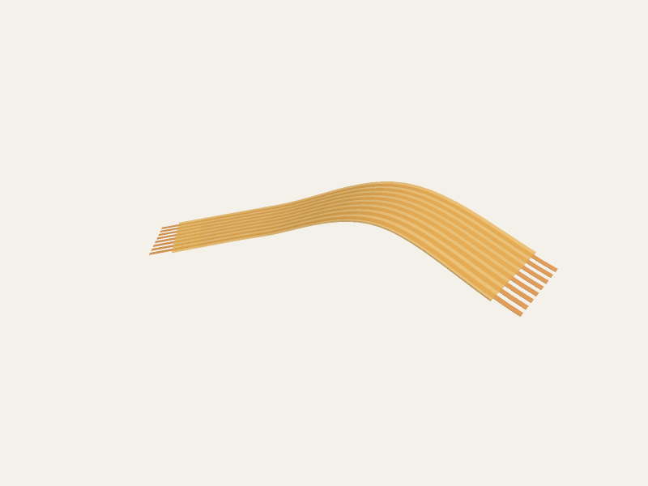

# @tscircuit/generate-fpc-cable

Generate smooth, routed FPC/ribbon cable geometry as:

- textured glTF 2.0 JSON,
- binary GLB, and
- watertight [`manifold-3d`](https://github.com/elalish/manifold) solids.

The centerline passes through the supplied start, navpoints, and end. A
parallel-transport frame keeps the ribbon orientation stable as it bends in
three dimensions. The rendered asset contains a translucent amber polyimide
cover, a subtle procedural weave texture, individual brushed-copper conductors
inside the cover, and uncovered contacts at both ends.



## Install

```sh
bun add @tscircuit/generate-fpc-cable
```

## Define a cable

All coordinates, pitch, and thickness values use the same caller-selected unit
(normally millimeters).

```ts
import type { FpcCableDefinition } from "@tscircuit/generate-fpc-cable"

const cable: FpcCableDefinition = {
  start: { x: 0, y: 0, z: 0 },
  end: { x: 42, y: 1, z: 3 },
  wireCount: 8,
  pitch: 1,
  navPoints: [
    { x: 12, y: 7, z: 2 },
    { x: 27, y: 6, z: 7 },
  ],
}
```

Points can also be supplied as `[x, y, z]` tuples.

## Generate GLB

`generateFpcCableGlb` returns a complete in-memory `.glb`, including both PNG
textures.

```ts
import { generateFpcCableGlb } from "@tscircuit/generate-fpc-cable"

const glb = generateFpcCableGlb(cable)
await Bun.write("ribbon-cable.glb", glb)
```

## Generate glTF JSON

`generateFpcCableGltf` returns self-contained JSON. Its binary mesh and texture
buffer is embedded as a data URI, so no sidecar files are required.

```ts
import { generateFpcCableGltf } from "@tscircuit/generate-fpc-cable"

const gltf = generateFpcCableGltf(cable)
await Bun.write("ribbon-cable.gltf", gltf.bytes)
console.log(gltf.dimensions)
```

## Generate manifold-3d solids

The manifold result retains the cover and each conductor separately for
multi-material or CAD workflows. `combined` is their boolean union. Call
`dispose()` when finished to release the owned WASM objects.

```ts
import { createFpcCableManifolds } from "@tscircuit/generate-fpc-cable"

const model = await createFpcCableManifolds(cable)
try {
  console.log(model.polyimide.status()) // "NoError"
  console.log(model.conductors.length) // 8
  console.log(model.combined.getMesh())
} finally {
  model.dispose()
}
```

## Options

```ts
const glb = generateFpcCableGlb(cable, {
  polyimideThickness: 0.18,
  copperThickness: 0.035,
  conductorWidth: 0.52,
  edgeMargin: 0.35,
  exposedContactLength: 2.4,
  samplesPerSpan: 16,
  up: [0, 0, 1],
  polyimideColor: [1, 0.96, 0.9, 0.76],
  copperColor: [1, 0.9, 0.76, 1],
})
```

Dimension defaults are tuned for millimeter inputs. `conductorWidth`,
`edgeMargin`, and `exposedContactLength` otherwise scale from `pitch`.

## Tests

```sh
bun test
bun run snapshot:update
```

Visual regression tests render the generated GLB entirely in JavaScript with
[PoppyGL](https://github.com/tscircuit/poppygl) and assert the images with
`toMatchPngSnapshot`.
